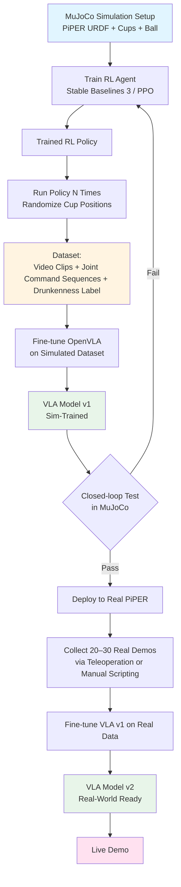
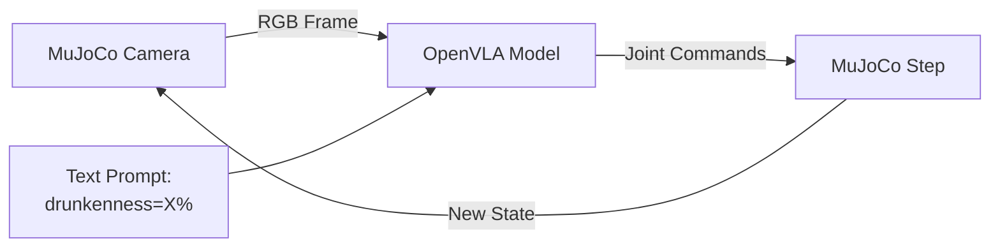
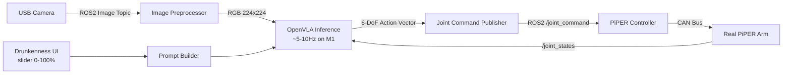

# Rage Cage Robot — VLA Project Primer

A 48-hour hackathon project that turns the **AgileX PiPER** 6-DOF arm into a "drunk" rage cage player. The arm watches a single stack of cups through an external camera, bounces a ping pong ball off a table, and lands it in the stack — with an adjustable "drunkenness" parameter that controls how wobbly and error-prone the throw is.

> **Note on the game:** Rage cage (a.k.a. slap cup) uses a single cluster of cups in the center of the table, not the two triangular formations of beer pong. The number of cups in the stack varies as the game progresses (we'll support 1–10 cups, all within a 10×10 cm area). The bounce distance is short — much shorter than beer pong.

This document is the team primer **and** a working spec you can feed to coding agents (Claude Code, Cursor, etc.).

---

## Table of Contents

1. [Project Overview](#1-project-overview)
2. [Hardware](#2-hardware)
3. [High-Level Approach](#3-high-level-approach)
4. [End-to-End Flow Diagram](#4-end-to-end-flow-diagram)
5. [Phase 1 — Simulation-Only Pipeline](#5-phase-1--simulation-only-pipeline)
6. [Phase 2 — Real Hardware Deployment](#6-phase-2--real-hardware-deployment)
7. [Gotchas & Things That Will Bite You](#7-gotchas--things-that-will-bite-you)
8. [Suggested 48-Hour Timeline](#8-suggested-48-hour-timeline)
9. [References & Resources](#9-references--resources)

---

## 1. Project Overview

### The Concept
A robot arm that plays rage cage, but with personality. A single stack of cups sits in the center of the table; the arm bounces a ping pong ball off the table and sinks it into the stack. The "drunkenness" parameter (0–100%) introduces controlled imperfection — at 0% it lands shots reliably; at 80% it overshoots, wobbles, and misses in a comedic way.

### Success Criteria (MVP)
- Arm reliably bounces ball into the stack at **drunkenness = 0** (≥70% hit rate)
- Stack configurations: 1–10 cups packed together, stack positioned anywhere within a **10cm × 10cm** square
- Drunkenness parameter visibly changes behavior (wobble, undershoot/overshoot)
- Live demo runs end-to-end on real hardware

### Stretch Goals
- Arm picks up the ping pong ball autonomously (instead of pre-loaded in gripper)
- Vision-based stack detection (no manual stack pose input)
- Reactive — adjusts after misses

---

## 2. Hardware

| Component | Spec |
|---|---|
| **Arm** | AgileX PiPER, 6-DOF, 1.5 kg payload, 626 mm reach, ±0.1 mm repeatability |
| **Communication** | CAN bus (needs CAN-to-USB adapter for laptop) |
| **Control** | Python SDK + ROS1/ROS2 driver (`piper_ros`) |
| **Camera** | External, mounted to view table + cups (USB webcam works) |
| **Gripper** | Two-finger gripper (ball pre-loaded for MVP) |
| **Sim machine** | M1 Pro MacBook, 32 GB RAM (all of Phase 1) |
| **Control machine** | Linux box running ROS2 (all of Phase 2 — real arm) |

### Two-Machine Setup

We deliberately split the work across two machines to play to each one's strengths:

- **Mac (M1 Pro)** — runs MuJoCo simulation, RL training, dataset generation, and VLA fine-tuning. Apple Silicon handles simulation and ML training comfortably (MPS backend for PyTorch).
- **Linux box** — runs ROS2, the PiPER driver, the camera node, and live VLA inference against the real arm. ROS2 is first-class on Linux and the CAN tooling for the PiPER is built and tested there.

The handoff between machines is just file transfer: trained VLA weights (a few hundred MB with LoRA adapters) move from Mac to Linux via `scp` / `rsync` / shared drive. No live network coupling between the two needed.

### Key Hardware Notes
- The PiPER GitHub org has URDF files, ROS2 packages, and Gazebo simulation assets — start here: `github.com/agilexrobotics`
- CAN interface requires `can_activate.sh` script from the `piper_ros` repo before the arm responds (Linux only — runs on the control machine)
- Working envelope is large (626 mm reach) but for a tabletop bounce, you'll constrain motion to a smaller region
- Make sure the Linux box has a CUDA GPU if you want VLA inference faster than ~5 Hz. CPU-only inference works but is sluggish.

---

## 3. High-Level Approach

We use a **two-stage training pipeline**:

1. **Stage A — RL in simulation** discovers successful throw trajectories
2. **Stage B — VLA fine-tuning** learns to imitate those trajectories from camera input

Why both? RL is good at *exploring* and finding what works without demonstrations. VLAs are good at *generalizing* from visual input to motor commands. Combining them gives you a perception-driven controller without hand-crafting trajectories.

### Why not pure RL?
Pure RL requires the camera-to-action mapping be learned through trial and error — expensive in sim, basically impossible on real hardware in 48 hours.

### Why not pure VLA?
Off-the-shelf VLAs (OpenVLA, etc.) weren't trained on your specific arm or task. They need demonstrations to fine-tune, and you need a way to generate those demonstrations — that's what the RL agent provides.

---

## 4. End-to-End Flow Diagram



---

## 5. Phase 1 — Simulation-Only Pipeline

**Machine: Mac (M1 Pro)**

**Goal:** Get the full pipeline working end-to-end without touching the real arm. By the end of Phase 1 you should have a VLA model that, when shown simulated camera frames, outputs joint commands that successfully bounce the ball into cups *in simulation*.

Everything in this phase runs on the Mac. No ROS, no real arm, no Linux box needed yet. The deliverable at the end of this phase is a fine-tuned VLA checkpoint (LoRA adapter weights + base model reference) that we'll ship over to the Linux box for Phase 2.

### 5.1 Simulator Choice: MuJoCo

**Recommendation: MuJoCo** for the M1 Mac. Isaac Sim has weak macOS support; Gazebo is fine but heavier and less Python-native.

MuJoCo pros:
- Lightweight, fast on Apple Silicon
- Excellent Python API (`mujoco` package on PyPI)
- Good integration with Stable Baselines 3
- Has built-in offscreen rendering for camera observations

MuJoCo cons:
- Need to author or convert PiPER URDF to MJCF (MuJoCo's XML format)
- Ping pong ball physics (high coefficient of restitution, low mass) needs tuning

### 5.2 Setup Checklist

```
[ ] Install MuJoCo (pip install mujoco)
[ ] Install Stable Baselines 3 (pip install stable-baselines3[extra])
[ ] Convert PiPER URDF → MJCF (use mujoco's URDF importer, or manually author)
[ ] Build scene: arm + table + cup primitives + ball
[ ] Tune ball physics (restitution ~0.85, mass ~2.7g)
[ ] Set up offscreen camera in scene matching real-world camera viewpoint
[ ] Create Gym environment wrapper around MuJoCo scene
```

### 5.3 RL Training (Stage A)

#### Environment Definition

| Field | Value |
|---|---|
| **Observation space** | Camera image (128×128 RGB) + arm joint positions (6 floats) + cup stack center position (2 floats) + cup count (1 int) |
| **Action space** | Continuous, 6-DOF joint position targets (or torques) |
| **Reward** | +100 if ball lands in any cup in the stack; +shaped reward proportional to ball-bounce-point distance to stack center; small negative per timestep |
| **Episode length** | ~150 timesteps (1.5s at 100Hz control) |
| **Reset** | Randomize stack center position within 10×10 cm region; randomize cup count (1–10); cups packed tightly together in the stack; reset arm to home pose; ball spawns in gripper |

#### Algorithm Recommendation
- **PPO** — easier to tune, more forgiving with reward design, good for continuous control
- Alternative: **SAC** if sample efficiency matters more

#### Training Time on M1 Pro
- Expect 30 min – 2 hours for a working policy
- Run with `n_envs=4` (parallel environments) to use M1 cores

#### Sample Training Loop

```python
import mujoco
import gymnasium as gym
from stable_baselines3 import PPO
from stable_baselines3.common.vec_env import SubprocVecEnv

# Custom env wrapping MuJoCo scene
env = SubprocVecEnv([lambda: RageCageEnv() for _ in range(4)])

model = PPO(
    "MultiInputPolicy",  # because obs is dict (image + state)
    env,
    learning_rate=3e-4,
    n_steps=2048,
    batch_size=64,
    verbose=1,
    tensorboard_log="./tb_logs/"
)

model.learn(total_timesteps=500_000)
model.save("rl_thrower_policy")
```

### 5.4 Demonstration Generation

Once the RL agent reliably throws, run it many times and record everything:

```
For each episode (target ~200 successful episodes):
    1. Randomize stack: center position within 10x10cm region, cup count 1-10, cups packed tightly
    2. Pick random drunkenness level (0-100%)
    3. If drunkenness > 0, inject noise into RL agent's actions proportional to level
    4. Run episode, record frame-by-frame:
        - Camera image (offscreen rendered)
        - Joint positions at this frame
        - Action command output
        - Drunkenness label
        - Final outcome (hit/miss + which cup)
    5. Save successful episodes (and a balanced number of drunk-failures)
```

**Storage format:** HDF5 or LeRobot dataset format (recommended — OpenVLA tooling supports it).

### 5.5 VLA Fine-Tuning (Stage B)

#### Model Selection: OpenVLA vs OpenPi vs Alternatives

There are two main open-source VLA families worth considering. The "right" choice depends on what hardware you actually have access to.

| Model | Params | Architecture | License | Best for |
|---|---|---|---|---|
| **OpenVLA-7B** | 7B | Llama-2 + SigLIP, autoregressive action tokens | MIT | Best documented, largest community, easiest to fine-tune at small scale |
| **OpenVLA-OFT** | 7B | OpenVLA + optimized fine-tuning recipe | MIT | Better SOTA results (97.1% on LIBERO), supports action chunking |
| **π0 (pi0)** | ~3B | PaliGemma backbone + flow-matching action head | Apache 2.0 | More efficient, faster inference, newer (Physical Intelligence) |
| **π0.5 (pi05)** | ~3B | Upgraded π0 (Sept 2025) | Apache 2.0 | Better open-world generalization than π0 |
| **Octo-Small** | 27M | Transformer policy | MIT | Tiny — works on a 24GB consumer GPU comfortably; weaker generalization |

**Practical guidance for this hackathon:**

- If you have access to a Linux box with an **NVIDIA GPU ≥24GB VRAM**: use **OpenVLA** with LoRA. It's the most documented path and works with reasonable batch sizes.
- If you have access to a Linux box with **40GB+ VRAM** (A100, A6000, L40S): consider **π0** or **π0.5** — they're newer and more efficient, but the OpenPi stack is JAX/XLA-based, NVIDIA-only, and explicitly Ubuntu 22.04 only.
- If you only have the Mac and small cloud credit: rent an **RTX 4090 or A6000 on RunPod/Lambda** for the fine-tuning step (~$0.40–$1.50/hr). Plan for 4–12 hours of training time.
- If you want to keep everything truly local on the Mac: **OpenVLA + LoRA + QLoRA (4-bit base)** is technically feasible but slow. See "Fine-tuning on the Mac" below.

#### System Requirements

| Path | Model | GPU / Hardware | Memory | Realistic for hackathon? |
|---|---|---|---|---|
| **Mac local (MPS)** | OpenVLA-7B + LoRA + 4-bit quant | M1/M2/M3 with 32GB+ unified memory | ~16–24 GB used | Yes, but slow (~5–10x slower than CUDA). Plan for overnight training. |
| **Mac local (MLX)** | Smaller models (Octo) | M1/M2/M3 16GB+ | <16 GB | Yes — Octo is small enough |
| **Cloud GPU (recommended)** | OpenVLA-7B + LoRA | Single RTX 4090 (24GB) or A100 (40GB) | 16–25 GB | Best balance of speed and cost |
| **Cloud GPU (high end)** | π0 / π0.5 + LoRA | A6000 (48GB) or A100 80GB | 40–50 GB (community reports show "low_mem" config still needs ~44 GB) | If you want to try π0 — note OpenPi requires Linux + NVIDIA + Ubuntu 22.04 |
| **Cloud GPU (full fine-tune)** | OpenVLA-7B full | 8x A100 80GB | ~640 GB | Not needed for a hackathon — stick with LoRA |

#### Where to Actually Run the Fine-Tune

You have three realistic options for this hackathon:

**Option A — Cloud GPU (recommended).** Spin up an RTX 4090 or A6000 instance for a few hours during Phase 1c. RunPod, Lambda Labs, and Vast.ai all have these for under $1/hr. Total cost for the hackathon: probably $5–$20. You upload your simulated dataset, train, download the LoRA adapter (~100–500 MB), and you're done.

**Option B — Mac local fine-tune (slow but free).** Use OpenVLA + LoRA with 4-bit base quantization on the M1 Pro. Expect 6–12 hours of training. Works, but eats most of one day. Use this only if you can't afford even modest cloud credit. See setup details below.

**Option C — Linux box GPU (if available).** If your Linux control machine happens to have a decent NVIDIA GPU, do the fine-tune there. Saves the Mac↔Linux file transfer and gives you direct access to the real-data fine-tuning loop in Phase 2.

#### OpenVLA Fine-Tuning Setup (Cross-Platform)

```python
# Works on CUDA (Linux) or MPS (Mac) — switch the device string
from transformers import AutoProcessor, AutoModelForVision2Seq
from peft import LoraConfig, get_peft_model
import torch

DEVICE = "cuda" if torch.cuda.is_available() else "mps"

processor = AutoProcessor.from_pretrained("openvla/openvla-7b")
model = AutoModelForVision2Seq.from_pretrained(
    "openvla/openvla-7b",
    torch_dtype=torch.bfloat16,
    low_cpu_mem_usage=True
).to(DEVICE)

# LoRA config — recommended for any setup with <40GB VRAM
lora_config = LoraConfig(
    r=32, lora_alpha=16,
    target_modules="all-linear",  # standard for OpenVLA
    lora_dropout=0.0
)
model = get_peft_model(model, lora_config)

# Training: MSE loss between predicted action tokens and ground-truth joint commands
```

**Reference hyperparameters** (from OpenVLA LIBERO fine-tunes — scale down for hackathon):
- Learning rate: `5e-4` (LoRA), `1e-5` (full)
- Batch size: 16 per GPU (cloud), 1–4 on Mac
- LoRA rank: 32
- Training steps: 50k–60k for SOTA results; 5k–10k is enough for an MVP demo
- bfloat16 throughout

#### Fine-Tuning on the Mac (M1 Pro, 32GB)

If you go the local route, here are the specific tweaks needed:

```python
# Mac-specific tuning
import torch

# 4-bit quantization (via mlx or bitsandbytes-compatible alternative)
# Note: bitsandbytes does NOT work on Mac — use the quanto library instead
from optimum.quanto import quantize, qint4, freeze

quantize(model, weights=qint4)
freeze(model)

# Memory savers
training_args = {
    "per_device_train_batch_size": 1,
    "gradient_accumulation_steps": 16,  # effective batch size 16
    "gradient_checkpointing": True,
    "bf16": True,  # preferred on Apple Silicon
    "dataloader_num_workers": 0,  # MPS multiprocessing is flaky
    "dataloader_pin_memory": False,
}
```

Realistic Mac numbers:
- Peak memory: ~18–22 GB unified memory (leaves room for OS + browser)
- Training throughput: ~5–10x slower than RTX 4090
- For 5k steps at batch 1: roughly 8–12 hours
- For the demo dataset (~200 episodes, ~10k frames), 2–4 hours of training at ~1k steps is enough to see learning

**Prompt format for drunkenness:**
```
"Bounce the ball into the cup stack. Drunkenness level: 60%."
```

#### OpenPi (π0 / π0.5) Notes

If you go this route — be aware of the gotchas before committing:

- **Linux + NVIDIA only.** The OpenPi repo explicitly says "tested with Ubuntu 22.04, we do not currently support other operating systems." JAX/XLA on Mac is not a viable path here.
- **Memory reality.** The README's "low_mem" config understates real usage; community reports show ~44 GB peak even with LoRA. Plan for an A6000 (48GB), not a 4090.
- **Data format.** OpenPi expects LeRobot dataset format. Convert your simulated demos to this format using LeRobot's tooling.
- **Workflow.** Install via `uv`, edit `src/openpi/training/config.py` for your custom robot, run `scripts/compute_norm_stats.py`, then `scripts/train.py`.
- **Inference.** OpenPi has its own inference runner. Don't expect it to drop into a standard HuggingFace transformers pipeline.

For a 48-hour hackathon, **OpenVLA is the safer bet** unless someone on the team has prior OpenPi experience.

### 5.6 Closed-Loop Simulation Test

Run the VLA in simulation to verify the full pipeline:



**Pass criteria:** ≥50% hit rate at drunkenness=0 in simulation. If lower, return to RL training or check data pipeline.

---

## 6. Phase 2 — Real Hardware Deployment

**Machine: Linux box (running ROS2)**

**Goal:** Get the sim-trained VLA working on the actual PiPER arm in the physical setup.

This phase runs entirely on the Linux machine. The Mac's job is done once it produces the fine-tuned VLA checkpoint — copy that over to the Linux box and continue from there.

### 6.0 Handoff from Mac to Linux

Before starting Phase 2, transfer from Mac to Linux:

```
[ ] LoRA adapter weights (~100-500 MB)
[ ] dataset_statistics.json (action normalization stats from sim training)
[ ] Camera intrinsics file (if you matched sim → real camera pose)
[ ] Inference script (inference.py from the vla/ folder)
[ ] Python environment file (requirements.txt or environment.yml)
```

Easiest: `rsync -avz` over local network, or push to a private GitHub/Hugging Face repo.

On the Linux side, re-create the Python env (use a venv or conda — match Mac versions for `transformers`, `peft`, `torch`). The base OpenVLA-7B model can be re-downloaded from Hugging Face directly on Linux; you don't need to ship 14GB across.

### 6.1 Bridging the Sim-to-Real Gap

The simulated VLA will *not* work out-of-the-box on real images. Three mitigations:

1. **Domain randomization in Phase 1** — vary lighting, textures, background clutter during sim rendering. Do this *during* Phase 1, not retroactively.
2. **Real-world fine-tuning** — collect a small dataset on the actual arm
3. **Camera matching** — physical camera position should match the simulated camera viewpoint as closely as possible

### 6.2 PiPER Setup (on Linux)

```bash
# On the Linux control machine
git clone https://github.com/agilexrobotics/Piper_ros.git
cd Piper_ros
./find_all_can_port.sh
./can_activate.sh
ros2 launch piper start_single_piper.launch.py
```

**Camera setup:**
- Mount external camera with clear view of cups + table + ball
- Calibrate intrinsics (`camera_calibration` ROS package)
- Note camera pose relative to arm base — encode this in your inference pipeline

### 6.3 Real Demonstration Collection

You need ~20–30 successful real throws to fine-tune. Two ways to get them:

**Option A — Scripted trajectory replay**
- Use the RL policy's actions as a starting point
- Manually tune via PiPER's Python SDK until throws succeed
- Record camera + joint commands during successful runs

**Option B — Teleoperation / kinesthetic teaching**
- PiPER supports "Teach by Dragging" mode
- Physically guide the arm through successful throws
- Record joint trajectories during teaching

**Recording script outline:**

```python
import rclpy
from sensor_msgs.msg import Image, JointState
import h5py

# Subscribe to /camera/image_raw and /joint_states
# On user trigger (e.g., spacebar), start recording
# Stop recording when ball lands (manual trigger or audio cue)
# Save (video_frames, joint_command_sequence, outcome) to HDF5
```

### 6.4 Real-World Fine-Tuning

Same setup as Section 5.5, but training data is now your 20–30 real demonstrations.

- Start from the sim-fine-tuned VLA (not the original OpenVLA)
- Lower learning rate further: `5e-5` LoRA
- Fewer epochs: 3–5 (small dataset, easy to overfit)

### 6.5 Live Inference Loop



**Inference rate:** OpenVLA on M1 will run at ~5–10 Hz. That's slow for fast dynamic motions. Mitigations:
- Use VLA to predict a *trajectory* (sequence of waypoints), not single actions
- Execute the trajectory open-loop with a fast low-level controller (~100 Hz)
- Re-query VLA before each throw, not within a throw

---

## 7. Gotchas & Things That Will Bite You

### Hardware / Setup
- **Two machines, two environments.** Mac runs Python/MuJoCo/PyTorch with MPS. Linux runs ROS2 + PyTorch with CUDA (or CPU). Keep `transformers`, `peft`, and `torch` versions aligned across both machines — version drift between sim and real env is a classic silent-failure source.
- **CAN-to-USB adapter required on the Linux box.** The PiPER doesn't speak USB directly. Make sure the adapter and `socketcan` drivers are installed *before* the hackathon. Test with `candump can0` to confirm.
- **Network between machines.** Ideally same LAN so you can `rsync` checkpoints quickly. Plan for ~500 MB of LoRA weights per iteration — over hotel WiFi this can be painful.
- **Camera calibration matters.** If your real camera pose differs from sim camera pose, your VLA will hallucinate. Match them or be prepared to fine-tune more. Photograph the real setup early and replicate in MuJoCo.
- **Arm safety envelope.** A throwing motion is fast and could damage things. Test slowly, define joint velocity limits in software, and clear the work area.

### Simulation
- **PiPER URDF → MJCF conversion is non-trivial.** Joint limits, inertias, and damping often need manual correction. Budget half a day for this.
- **Ping pong ball physics is finicky.** Default contact parameters give weird bounces. Tune `solref` and `solimp` in MuJoCo, and verify against real-world video early.
- **Offscreen rendering on Mac M1.** Make sure you can render camera frames headlessly — some MuJoCo builds have issues. Test rendering on day 0.
- **MJX vs MuJoCo Python.** MJX (JAX-based) is faster but more complex. For a hackathon, use plain `mujoco` Python bindings.

### RL Training
- **Reward shaping makes or breaks RL.** Pure sparse reward ("ball in stack = +100") often fails to learn. Add a dense shaping term (e.g., negative distance from ball-bounce-point to stack center).
- **Action space scaling.** If your policy outputs joint angles in radians but your env expects normalized [-1, 1], you'll get silent failures.
- **Episode length too short = no learning.** Make sure the agent has enough timesteps to complete a throw (~1–2 seconds of sim time).
- **Reset randomization too aggressive too soon.** Start with a fixed stack position and a fixed cup count, get one success, then progressively randomize stack position and cup count.

### VLA Fine-Tuning
- **Mac fine-tuning is slow, not impossible.** OpenVLA-7B LoRA on M1 Pro 32GB works with 4-bit quantization (via `optimum.quanto`, NOT bitsandbytes — that doesn't work on Mac) and gradient checkpointing, but it's roughly 5–10x slower than a 4090. Plan accordingly or rent a cloud GPU.
- **bitsandbytes does not work on Apple Silicon.** If you see tutorials using it, they won't run on Mac. Use `optimum.quanto` or MLX-native quantization instead.
- **OpenPi cannot run on Mac.** It's JAX/XLA on NVIDIA, Ubuntu 22.04 only. Don't waste time trying — fine-tune on cloud or on the Linux box if it has an NVIDIA GPU.
- **OpenPi "low_mem" config still needs ~44 GB VRAM.** The README's memory table understates real usage. RTX 4090 (24GB) is not enough for π0 LoRA. Use A6000 (48GB) or A100.
- **Action normalization mismatch.** OpenVLA and OpenPi both have specific action statistics from pre-training. If your dataset uses different scales (e.g., radians vs degrees), training silently diverges. Use the model's `dataset_statistics.json` format or compute your own and apply consistently at inference.
- **Video clip length.** OpenVLA takes single frames by default. If you want temporal context, use OpenVLA-OFT (supports action chunking) or use a different VLA like π0 (flow-matching head handles trajectories natively).
- **Drunkenness prompt may not generalize.** Neither model's text encoder was trained on "drunkenness". You may need to either (a) include drunkenness explicitly in the training prompt so it learns the association, or (b) abandon the prompt approach and inject noise post-inference at the requested level.
- **MPS support gaps.** Some PyTorch ops still fall back to CPU on MPS. Watch for `aten::...` warnings — these slow training dramatically. Update to latest nightly PyTorch if you hit them.

### Sim-to-Real
- **Visual gap is huge.** Don't expect sim-trained-only VLA to work on real images. Plan for ~20 real demos minimum.
- **Latency differs.** MuJoCo runs in zero time; real CAN bus has ~5–20ms round-trip. Your control timing may need adjustment.
- **Joint backlash and friction.** Real arms have these; sim doesn't (by default). The first few real throws will undershoot — expected.
- **Camera exposure / white balance.** Auto-exposure can change frame-to-frame and confuse the VLA. Lock exposure if possible.

### Time Management
- **Don't fine-tune the full 7B model.** LoRA only. Full fine-tune will eat your entire weekend.
- **Get end-to-end early, optimize later.** A working bad demo beats a perfect plan you didn't finish.
- **Test the demo path multiple times.** Live demos fail in the most embarrassing ways. Run through the full pipeline ≥3 times before the judges arrive.

---

## 8. Suggested 48-Hour Timeline

| Hours | Machine | Phase | Tasks |
|---|---|---|---|
| 0–4 | Mac | Setup | MuJoCo install, PiPER URDF → MJCF, basic scene, verify rendering on M1 |
| 0–4 | Linux | Setup (parallel) | ROS2 install, `piper_ros` clone, CAN adapter test, dry-run arm motion at low speed |
| 4–10 | Mac | Phase 1a | Gym env wrapper, reward function, PPO training kickoff |
| 10–16 | Mac | Phase 1b | Iterate on RL until reliable throws; start data collection in parallel |
| 16–22 | Mac or Cloud GPU | Phase 1c | OpenVLA setup, dataset formatting, LoRA fine-tune kickoff. Decide upfront: Mac (free but ~6–12hr) or cloud RTX 4090 (~$1, ~2hr) |
| 22–28 | Mac | Phase 1d | Closed-loop sim test, debug data pipeline, retrain as needed |
| 28–30 | Both | Handoff | `rsync` LoRA weights + scripts Mac → Linux, set up matching Python env |
| 30–34 | Linux | Phase 2a | Camera calibration, sanity check arm motion, verify ROS2 topics flowing |
| 34–40 | Linux | Phase 2b | Collect ~20 real demos, fine-tune VLA on real data (Mac can train, Linux can train if GPU) |
| 40–46 | Linux | Phase 2c | Live inference loop, integrate drunkenness UI, demo rehearsal |
| 46–48 | Linux | Polish | Final demo prep, slides, backup video in case of failure |

**Critical path:** Phase 1a → 1b → 1d → handoff → 2a. If any of these slip, cut stretch goals.

**Parallelism tip:** While the Mac is training the RL agent (long-running), have a teammate prep the Linux box: install ROS2, clone `piper_ros`, run the CAN setup, test arm jog commands. Don't serialize this work.

---

## 9. References & Resources

### Hardware & Docs
- AgileX PiPER product page: https://global.agilex.ai/products/piper
- PiPER GitHub org: https://github.com/agilexrobotics
- PiPER ROS2 driver: https://github.com/agilexrobotics/Piper_ros
- PiPER user manual: search "PiPER Quick Start User Manual"

### Simulation
- MuJoCo Python docs: https://mujoco.readthedocs.io/
- MuJoCo Menagerie (URDF/MJCF for many arms): https://github.com/google-deepmind/mujoco_menagerie
- Stable Baselines 3: https://stable-baselines3.readthedocs.io/

### VLA Models
- OpenVLA: https://openvla.github.io/
- OpenVLA GitHub: https://github.com/openvla/openvla
- OpenVLA-OFT (improved fine-tuning recipe): https://openvla-oft.github.io/
- OpenPi (π0, π0.5) GitHub: https://github.com/Physical-Intelligence/openpi
- π0 paper / Physical Intelligence blog: https://www.physicalintelligence.company/blog/pi0
- LeRobot (data format + tooling): https://github.com/huggingface/lerobot
- Octo (small alternative VLA): https://octo-models.github.io/

### Mac Fine-Tuning Tools
- MLX (Apple's ML framework): https://github.com/ml-explore/mlx
- optimum-quanto (Mac-compatible quantization): https://github.com/huggingface/optimum-quanto
- PyTorch MPS backend docs: https://pytorch.org/docs/stable/notes/mps.html

### Cloud GPU Options (for fine-tuning)
- RunPod: https://www.runpod.io/ (RTX 4090 ~$0.40/hr, A6000 ~$0.80/hr)
- Lambda Labs: https://lambdalabs.com/
- Vast.ai: https://vast.ai/

### Related Reading
- "Open X-Embodiment" — the dataset OpenVLA trained on
- "RT-2: Vision-Language-Action Models" — the conceptual foundation
- "Diffusion Policy" — alternative imitation learning approach worth knowing
- "π0: A Vision-Language-Action Flow Model for General Robot Control" — the π0 paper

---

## Appendix A — Quick Repo Structure

Suggested layout for the project repo:

```
rage_cage/
├── README.md
├── sim/
│   ├── mjcf/
│   │   └── piper_scene.xml
│   ├── env.py              # Gym env wrapper
│   ├── train_rl.py         # PPO training script
│   └── collect_demos.py    # Run trained policy, save dataset
├── vla/
│   ├── prepare_dataset.py  # Convert demos to OpenVLA format
│   ├── finetune.py         # LoRA fine-tuning
│   └── inference.py        # Closed-loop inference
├── real/
│   ├── camera_calib/
│   ├── teleop_record.py    # Real demo collection
│   ├── ros2_bridge.py      # VLA ↔ ROS2 plumbing
│   └── live_demo.py        # Main demo entry point
├── data/
│   ├── sim_demos/          # HDF5 / LeRobot dataset
│   └── real_demos/
└── docs/
    └── this_file.md
```

---

*Document version: v1.0 — built as a pre-hackathon primer. Update as decisions are made.*
